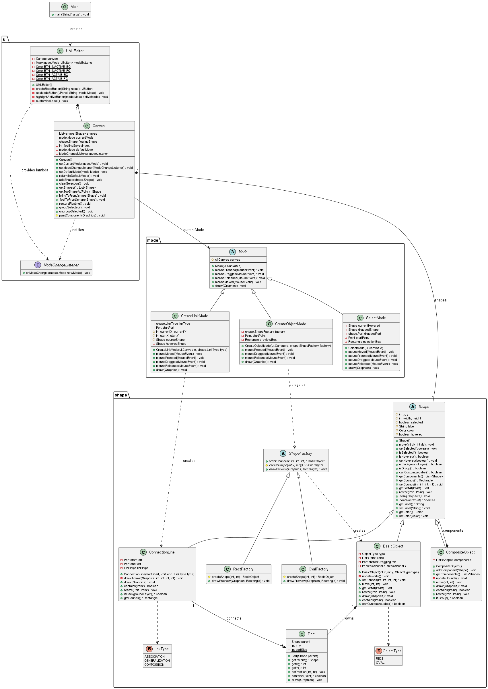

# UMLEditor

一個以**純 Java + Swing** 手寫實作的簡易 UML 編輯器,不依賴任何第三方框架。

可在畫布上建立 UML 物件(方形 / 橢圓)、用三種連接線連結物件,並支援選取、移動、縮放、群組、自訂標籤樣式、刪除等編輯操作,以及存檔 / 讀檔與匯出 PNG。專案以三個經典物件導向設計模式(State / Composite / Factory Method)為骨架,適合作為設計模式與 Swing GUI 的教學範例。

---

## 功能特色

| 功能                      | 說明                                                                                                                                                                                               |
| ------------------------- | -------------------------------------------------------------------------------------------------------------------------------------------------------------------------------------------------- |
| **建立物件**        | 在畫布上拖曳出**矩形 (Rect)** 或**橢圓 (Oval)**。輕點一下會以預設大小 80×80 建立,拖曳則可自訂大小(支援反向拖曳)。                                                                     |
| **建立連線**        | 從物件的控制點 (Port) 拖曳到另一個物件的控制點,建立三種 UML 關係:**Association(關聯)**、**Generalization(泛化)**、**Composition(組合)**,各有不同的箭頭樣式。不允許物件連到自己。 |
| **選取 / 取消選取** | 點擊單一物件或**連線**選取(物件顯示控制點、連線以藍色粗線高亮);點擊空白處取消選取;也可在空白處拖曳出**選取框**框選多個物件。                                                           |
| **移動物件**        | 拖曳已選取的物件即可移動;群組會帶著所有成員一起移動。                                                                                                                                              |
| **縮放物件**        | 拖曳物件四周的控制點 (Port) 調整大小(Rect 8 點、Oval 4 點)。                                                                                                                                       |
| **群組 / 解散群組** | 透過 `Edit` 選單把多個選取物件組成群組 (Composite),或將群組解散還原。群組可巢狀。                                                                                                                 |
| **自訂標籤樣式**    | 透過 `Edit → Label` 開啟對話框,修改選取物件的**名稱文字**與**填充顏色**。                                                                                                            |
| **刪除**            | 按 `Delete` 鍵(或 `Edit → Delete`)刪除選取的物件 / 連線 / 群組;刪除物件時,連在它(含群組內子物件)身上的連線會一併刪除。                                                                         |
| **存檔 / 讀檔**     | `File → Save`(Ctrl+S)/ `File → Open`(Ctrl+O),以 `.uml` 檔保存整張圖(物件、群組、連線、標籤、顏色)。                                                                                        |
| **匯出 PNG**        | `File → Export PNG`(Ctrl+E)把圖匯出成圖片,不含控制點與選取框。                                                                                                                                  |
| **懸停回饋**        | 滑鼠移到物件上時即時亮起其控制點,提供清楚的操作提示。                                                                                                                                              |
| **圖層 (z-order)**  | 連線的線身永遠在底層、物件在上層,但**箭頭畫在物件之上**,不會被物件遮住;選取的物件會暫時浮到最上層方便操作(連線不浮起)。                                                                      |

### 快捷鍵

| 按鍵       | 動作                         |
| ---------- | ---------------------------- |
| `Delete` | 刪除選取的物件 / 連線 / 群組 |
| `Ctrl+S` | 存檔(`.uml`)               |
| `Ctrl+O` | 開啟 `.uml` 檔              |
| `Ctrl+E` | 匯出 PNG                     |

對應的 Use Case 圖請見 [`UML/`](UML/) 目錄(UseCase A~G);刪除、存讀檔、匯出 PNG(Use Case H~J)的流程說明請見 [`docs/程式執行流程與函式呼叫順序報告.md`](docs/程式執行流程與函式呼叫順序報告.md)。

---

## 整體架構

本專案分為三個套件,**依賴方向由上而下:`ui` → `mode` → `shape`**。

```
Main  ──►  ui (介面/畫布)  ──►  mode (操作模式)  ──►  shape (圖形物件)
```

- **`ui/`** — 使用者介面。`UMLEditor`(主視窗、工具列、選單)與 `Canvas`(畫布,系統樞紐)。
- **`mode/`** — 各種編輯模式(選取、建立物件、建立連線),封裝「滑鼠在畫布上的行為」。
- **`shape/`** — 圖形物件、連接線、控制點與相關工廠類別。

### 核心設計模式

整份程式碼圍繞三個設計模式組織,理解這三者就掌握了大局:

#### 1. State Pattern(狀態模式)— `mode/`

`Canvas` 本身**不解讀滑鼠事件**,只在建構子裡掛一個 `MouseAdapter`,把所有 `mousePressed / Dragged / Released / Moved` 原封不動轉交給「目前模式」`currentMode`。真正決定「該畫圖、拉線、還是選取」的是各個 `Mode` 子類別。

- `Mode`(抽象基底):定義四個滑鼠方法 + `draw(Graphics)`,預設皆空實作。
- `SelectMode` / `CreateObjectMode` / `CreateLinkMode`:三種具體模式。
- 「一次性動作」(畫完一個物件或一條線)結束後,會自動切回預設的 `SelectMode`。

#### 2. Observer(觀察者)— 模式切換廣播

模式切換**一律經過** `Canvas.setCurrentMode()`,它切換後透過 `ModeChangeListener` 廣播。`UMLEditor` 註冊此監聽器來更新工具列按鈕的高亮。好處是**按鈕高亮邏輯只有一份**:不論「使用者點按鈕」還是「畫完自動回 Select」,都走同一條路徑。

#### 3. Composite + Factory Method — `shape/`

- **Composite Pattern**:`Shape`(抽象基底)是所有圖形的共同型別。`BasicObject`(單一圖形)與 `CompositeObject`(群組)都是 `Shape`;群組內部持有 `List<Shape>`,可巢狀,`move()` / `draw()` / `drawOverlay()` 會遞迴處理所有成員;刪除時也透過 `getComponents()` 遞迴找出群組內的子物件,連帶清除連到它們的連線。
- **Factory Method Pattern**:`ShapeFactory.orderShape()` 是固定建立流程,把「`new` 哪種圖形」延遲給子類別 `RectFactory` / `OvalFactory` 決定。`CreateObjectMode` 只持有抽象的 `ShapeFactory`,完全不認得具體型別。

> **設計慣例**:整個專案刻意**避免 `instanceof`**,改用 `Shape` 基底上可被覆寫的多型查詢方法(`isGroup()`、`canCustomizeLabel()`、`isBackgroundLayer()`、`getComponents()`、`getPortAt()`、`resize()`、`isAttachedToAny()`、`drawOverlay()`),讓 `Canvas` / `UMLEditor` 不需知道具體型別。
>
> **兩輪繪製**:`Canvas` 先依清單順序呼叫每個圖形的 `draw()`(本體),再呼叫每個圖形的 `drawOverlay()`(前景層),最後才畫模式的暫時 UI。連線的線身在第一輪、箭頭在第二輪,因此箭頭永遠不會被物件遮住。詳見 [`docs/繪圖機制筆記_paintComponent_repaint_draw.md`](docs/繪圖機制筆記_paintComponent_repaint_draw.md) 5.5 節。

### 類別圖 (Class Diagram)



> ⚠️ 此類別圖**尚未反映**刪除、存讀檔、匯出 PNG 這一輪的改動(例如 `DiagramFileIO` 類別、`Shape.drawOverlay()` / `isAttachedToAny()`、`Canvas.deleteSelected()` 等),以下方「主要類別職責」表為準。
>
> 原始檔為 [`UML/01_CompleteClassDiagram.plantuml`](UML/01_CompleteClassDiagram.plantuml)。修改後可用 PlantUML 重新產生 PNG(需先下載 `plantuml.jar`,見下方 [產生 UML 圖](#產生-uml-圖)):
>
> ```bash
> java -jar plantuml.jar UML/01_CompleteClassDiagram.plantuml
> ```

### 主要類別職責

| 套件      | 類別                                                 | 職責                                                                                                                                     |
| --------- | ---------------------------------------------------- | ---------------------------------------------------------------------------------------------------------------------------------------- |
| `ui`    | `UMLEditor`                                        | 主視窗 (JFrame)。擺放工具列按鈕、選單與快捷鍵,監聽模式變更以更新按鈕高亮;負責檔案對話框、標籤對話框與錯誤訊息等 UI。                     |
| `ui`    | `Canvas`                                           | 畫布 (JPanel),系統樞紐。維護圖形清單 (z-order)、轉發滑鼠事件給當前模式、兩輪繪圖、處理群組/解散/刪除、讀檔後替換圖形、繪製匯出用的影像。 |
| `ui`    | `ModeChangeListener`                               | 模式變更事件介面 (Observer)。                                                                                                            |
| `ui`    | `DiagramFileIO`                                    | 存檔 / 讀檔(Java 序列化 +`ObjectInputFilter` 白名單)與匯出 PNG,不含任何 UI 邏輯。                                                      |
| `mode`  | `Mode`                                             | 模式抽象基底 (State Pattern)。                                                                                                           |
| `mode`  | `SelectMode`                                       | 選取、移動、縮放、框選、懸停。                                                                                                           |
| `mode`  | `CreateObjectMode`                                 | 拖曳建立物件,委派給 `ShapeFactory`。                                                                                                    |
| `mode`  | `CreateLinkMode`                                   | 從 Port 拉線建立 `ConnectionLine`。                                                                                                     |
| `shape` | `Shape`                                            | 圖形抽象基底 (Composite Pattern)。                                                                                                       |
| `shape` | `BasicObject`                                      | 單一圖形(Rect / Oval),持有控制點 Port。                                                                                                  |
| `shape` | `CompositeObject`                                  | 群組,內部持有子圖形清單。                                                                                                                |
| `shape` | `ConnectionLine`                                   | 連接兩個 Port 的連線,可被點選;線身畫在底層、依 `LinkType` 畫的箭頭畫在前景層。                                                          |
| `shape` | `Port`                                             | 物件四周的控制點(用於縮放與連線端點)。                                                                                                   |
| `shape` | `ShapeFactory` / `RectFactory` / `OvalFactory` | 工廠方法,建立具體圖形。                                                                                                                  |
| `shape` | `ObjectType` / `LinkType`                        | 列舉型別,取代魔術字串。                                                                                                                  |

---

## 專案結構

```
UMLEditor/
├── Main.java              # 程式進入點
├── ui/                    # 使用者介面(主視窗、畫布、事件介面、檔案 IO)
├── mode/                  # 編輯模式(選取、建立物件、建立連線)
├── shape/                 # 圖形物件、連接線、控制點、工廠類別
├── UML/                   # 設計圖(類別圖、Use Case 圖的 .puml 原始檔與 PNG)
└── docs/                  # 中文學習筆記(見下表)
```

### 學習筆記(`docs/`)

| 筆記                                                                                | 內容                                                                                                |
| ----------------------------------------------------------------------------------- | --------------------------------------------------------------------------------------------------- |
| [程式執行流程與函式呼叫順序報告](docs/程式執行流程與函式呼叫順序報告.md)             | 從啟動到各 Use Case(A~J)的完整函式呼叫順序                                                          |
| [繪圖機制筆記](docs/繪圖機制筆記_paintComponent_repaint_draw.md)                     | `repaint` / `paintComponent` / `draw` 的關係,以及兩輪繪製 `drawOverlay`                     |
| [事件監聽機制筆記](docs/事件監聽機制筆記.md)                                         | 點按鈕到換模式、換按鈕顏色的呼叫鏈;`ActionListener` / `MouseListener` / `MouseAdapter` 的差別 |
| [FunctionalInterface 與 Lambda 筆記](docs/FunctionalInterface與Lambda筆記.md)        | 以 `ModeChangeListener` 為例:`@FunctionalInterface`、Lambda、方法參考,以及多設一個介面的解耦理由 |
| [功能更新筆記:刪除、存讀檔、匯出與修正](docs/功能更新筆記_刪除_存讀檔_匯出與修正.md) | 刪除 / 存讀檔 / 匯出 PNG 的設計理由、行為改動與 bug 修復                                            |

> `plantuml.jar` **未納入版控**(已被 `.gitignore` 排除),僅在需要重新產生 UML 圖時才需自行下載,見 [產生 UML 圖](#產生-uml-圖)。

---

## 編譯與執行

本專案為純 Java 專案,使用 `javac` 編譯,**不依賴 Maven / Gradle**。

```bash
# 編譯(輸出到 bin/)
javac -d bin Main.java mode/*.java shape/*.java ui/*.java

# 執行
java -cp bin Main
```

啟動後會開啟一個 800×600 的視窗:左側為工具列(Select / Association / Generalization / Composition / Rect / Oval),上方為 `File`(Open / Save / Export PNG)與 `Edit`(Group / Ungroup / Label / Delete)選單,中央為繪圖畫布。

### 環境需求

- JDK 9 以上(僅使用標準 Swing / AWT,無其他依賴;讀檔的反序列化白名單 `ObjectInputFilter` 需要 JDK 9+)。

> **關於 `.uml` 檔**:採 Java 序列化格式,修改 `shape/` 下類別的欄位後,舊檔可能無法讀回。讀檔時只允許本專案的圖形類別與必要的 JDK 類別,其餘一律拒絕,但仍建議只開啟自己存的檔案。

---

## 產生 UML 圖

`UML/` 目錄下的 PNG 圖**已隨專案附上**,平常閱讀不需任何額外工具。只有在你**修改了 `.puml` / `.plantuml` 原始檔、想重新產生 PNG** 時,才需要 PlantUML。

PlantUML 並未納入版控,請自行下載 `plantuml.jar`:

```bash
# 下載最新版 plantuml.jar(放在 UMLEditor/ 根目錄)
curl -L -o plantuml.jar https://github.com/plantuml/plantuml/releases/latest/download/plantuml.jar
```

> 也可至 [PlantUML 官方下載頁](https://plantuml.com/download) 取得。PlantUML 另需安裝 [Graphviz](https://graphviz.org/download/) 才能繪製部分圖型。

下載後即可重新產生圖檔:

```bash
# 產生單一圖
java -jar plantuml.jar UML/01_CompleteClassDiagram.plantuml

# 產生 UML/ 下所有圖
java -jar plantuml.jar UML/*.puml UML/*.plantuml
```
